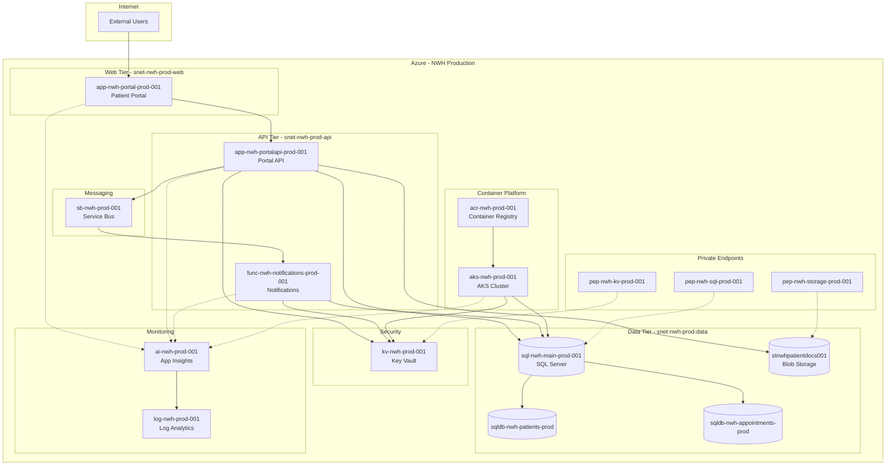

# Architecture and Dependency Map

**Northwind Health — Production Environment**  
**February 2026**

---

## Purpose

This document provides a visual representation of the Northwind Health production Azure environment, illustrating how applications, data services, and infrastructure components interconnect. Understanding these dependencies is essential for:

- **Impact analysis** before making configuration changes
- **Troubleshooting** production issues efficiently
- **Disaster recovery** planning and testing
- **Identifying single points of failure** and resilience gaps

---

## Architecture Diagram



---

## How to Read This Diagram

### Notation Guide

| Symbol | Meaning |
|--------|---------|
| Solid arrow (→) | Direct dependency or data flow |
| Dashed arrow (⇢) | Monitoring/telemetry or private network connection |
| Rectangle | Compute resource (App Service, Function, AKS) |
| Cylinder | Data store (SQL Database, Storage Account) |
| Grouped box | Logical tier or subnet boundary |

### Tiers and Layers

The architecture follows a three-tier design:

1. **Web Tier** (`snet-nwh-prod-web`) — External-facing applications
2. **API Tier** (`snet-nwh-prod-api`) — Backend services and APIs
3. **Data Tier** (`snet-nwh-prod-data`) — Databases, storage, and private endpoints

---

## Critical Data Flows

### Patient Portal Flow (Primary Path)

```
External Users → app-nwh-portal-prod-001 → app-nwh-portalapi-prod-001 → sql-nwh-main-prod-001
```

This is the primary user-facing path. Disruption to any component in this chain results in portal unavailability.

### Notification Flow (Async Processing)

```
app-nwh-portalapi-prod-001 → sb-nwh-prod-001 → func-nwh-notifications-prod-001
```

Notifications are processed asynchronously via Service Bus. If this path is disrupted, notifications are delayed but do not impact portal availability.

### Document Storage Flow

```
app-nwh-portalapi-prod-001 → stnwhpatientdocs001 (via pep-nwh-storage-prod-001)
```

Patient documents are stored in blob storage, accessed via private endpoint for security.

---

## Security Architecture

### Private Endpoint Topology

All data-tier services are accessed via private endpoints, ensuring traffic stays within the Azure backbone and never traverses the public internet:

| Service | Private Endpoint | Private DNS Zone |
|---------|------------------|------------------|
| SQL Server | `pep-nwh-sql-prod-001` | `pdnsz-privatelink-sql` |
| Blob Storage | `pep-nwh-storage-prod-001` | `pdnsz-privatelink-blob` |
| Key Vault | `pep-nwh-kv-prod-001` | `pdnsz-privatelink-vault` |

### Secrets Management

All applications retrieve secrets from Key Vault (`kv-nwh-prod-001`) at runtime using managed identities. No connection strings or API keys are stored in application configuration.

---

## Network Topology

### Virtual Network

**VNet:** `vnet-nwh-prod-eastus-001`  
**Address Space:** 10.1.0.0/16

| Subnet | CIDR | Purpose |
|--------|------|---------|
| `snet-nwh-prod-web` | 10.1.1.0/24 | Web tier, App Service integration |
| `snet-nwh-prod-api` | 10.1.2.0/24 | API tier, Function App integration |
| `snet-nwh-prod-data` | 10.1.3.0/24 | Private endpoints, data services |

---

## Single Points of Failure Analysis

| Component | Risk Level | Impact if Unavailable | Mitigation Options |
|-----------|------------|----------------------|-------------------|
| SQL Server (`sql-nwh-main-prod-001`) | High | All applications fail | Geo-redundant backup, read replica |
| Key Vault (`kv-nwh-prod-001`) | High | All applications fail to authenticate | Soft-delete enabled, consider geo-redundancy |
| Service Bus (`sb-nwh-prod-001`) | Medium | Notifications delayed | Geo-DR pairing available |
| Storage (`stnwhpatientdocs001`) | Medium | Document access unavailable | GRS replication enabled |
| App Service Plan | Medium | Portal unavailable | Autoscaling configured |

### Recommended Resilience Improvements

1. **SQL Database** — Consider adding a read replica in a secondary region for disaster recovery scenarios
2. **Key Vault** — Validate soft-delete and purge protection are enabled; consider backup to secondary region
3. **Service Bus** — Evaluate geo-DR pairing if notification SLA is critical

---

## Observability

All compute resources send telemetry to Application Insights (`ai-nwh-prod-001`), which exports logs to Log Analytics (`log-nwh-prod-001`).

### Monitored Resources

- `app-nwh-portal-prod-001` — Frontend application
- `app-nwh-portalapi-prod-001` — Backend API
- `func-nwh-notifications-prod-001` — Notification processor
- `aks-nwh-prod-001` — Kubernetes cluster

### Monitoring Gaps Identified

The legacy VM (`vm-nwh-legacy-001`) does not appear to be sending telemetry to Application Insights. Recommend installing the Azure Monitor agent if this resource is retained.

---

## Recommendations

1. **Document all dependencies** — This diagram should be kept current as architecture evolves
2. **Test failover scenarios** — Conduct tabletop exercises for Key Vault and SQL outage scenarios
3. **Implement health checks** — Ensure all services have appropriate health endpoints monitored
4. **Review DR strategy** — Current architecture has appropriate backups but limited active-active capability
5. **Address legacy VM** — Identify owner and either integrate monitoring or plan decommission

---

## Appendix: Resource Inventory Summary

| Tier | Resource Count | Key Resources |
|------|----------------|---------------|
| Web | 2 | Portal App Service, App Service Plan |
| API | 3 | API App Service, Function App, App Service Plan |
| Data | 7 | SQL Server, 2 Databases, 2 Storage Accounts, 3 Private Endpoints |
| Security | 2 | Key Vault (primary), Key Vault (secondary) |
| Networking | 4 | VNet, 3 Subnets |
| Monitoring | 2 | App Insights, Log Analytics |
| Containers | 2 | Container Registry, AKS Cluster |

---

*This diagram reflects the production environment as of the audit date. Architecture changes should trigger an update to this documentation.*
