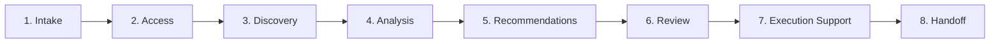

# Audit Methodology and Change Control Procedures

**Northwind Health — Azure Environment Audit**  
**February 2026**

---

## Part 1: How This Audit Was Performed

This section describes the methodology used to conduct the Azure environment audit, ensuring transparency about our process and the safety measures applied throughout the engagement.

---

### Audit Phases

The audit followed an eight-phase process designed to minimize risk while delivering comprehensive insights:



---

### Phase 1: Intake

**Duration:** 1–2 meetings

During intake, we gathered context about the business drivers, environment scope, and key stakeholders. Topics covered included:

- Number of subscriptions and approximate resource count
- Primary workloads and applications
- Compliance requirements (HIPAA, SOC2)
- Known issues or specific concerns
- Maintenance windows and change approval processes

---

### Phase 2: Access Provisioning

**Duration:** 1–3 days

Access was provisioned with the minimum permissions necessary for discovery:

| Access Level | Scope | Purpose |
|--------------|-------|---------|
| Reader | All in-scope subscriptions | Resource inventory, configuration review |
| Reader | Microsoft Entra ID | Identity and access review |
| Cost Management Reader | Cost Management | Cost data export and analysis |
| Log Analytics Reader | Relevant workspaces | Diagnostic and logging review |

**Read-Only First Policy:** No write access was provisioned during the discovery phase. This ensures that the audit process cannot accidentally modify production resources.

---

### Phase 3: Discovery

**Duration:** 2–5 days

Discovery involved systematic inventory and documentation of all Azure resources. Tools and methods used:

**Azure Resource Graph Queries**

Resource Graph queries were used to extract resource inventory, identify untagged resources, and locate orphaned resources:

```kusto
resources
| project subscriptionId, resourceGroup, name, type, location, tags
```

**Azure CLI**

The Azure CLI was used to export detailed resource configurations:

```bash
az resource list --subscription "<subscription-name>" --output json
```

**Azure Cost Management**

Cost data was exported for the assessment period to identify spending patterns and optimization opportunities.

**Discovery Outputs:**
- Complete resource inventory (CSV/JSON)
- Resource group organization map
- Tag usage analysis
- Network topology documentation
- Cost breakdown by service and environment

---

### Phase 4: Analysis

**Duration:** 3–5 days

During analysis, the discovery data was evaluated against best practices and client requirements:

| Analysis Area | Focus |
|---------------|-------|
| Naming & Organization | Consistency, discoverability, alignment with standards |
| Tagging | Completeness, accuracy, cost attribution capability |
| Cost | Top drivers, waste identification, optimization opportunities |
| Security | Private endpoints, Key Vault usage, RBAC configuration |
| Monitoring | App Insights coverage, log retention, alerting |
| Architecture | Dependencies, resilience, single points of failure |

---

### Phase 5: Recommendations

**Duration:** 2–3 days

Recommendations were developed with the following structure:

1. **Finding** — What was observed
2. **Risk** — Why it matters to the business
3. **Recommendation** — What action to take
4. **Effort** — Implementation complexity
5. **Priority** — Critical / High / Medium / Low

Recommendations were categorized as:
- **Quick Wins** — Low effort, immediate value
- **Short-Term** — Requires planning, achievable this month
- **Medium-Term** — Requires coordination, this quarter
- **Strategic** — Major initiative, ongoing effort

---

### Phase 6: Client Review

**Duration:** 1–2 meetings

Findings and recommendations were presented to stakeholders for validation and prioritization. The review session covered:

1. Executive summary of findings
2. Key risks and concerns
3. Cost analysis and savings opportunities
4. Recommended quick wins
5. Prioritization discussion
6. Next steps and execution planning

Client feedback was incorporated into final deliverables.

---

### Phase 7: Execution Support (if applicable)

For recommendations requiring implementation, we provided advisory support following strict change control procedures. All changes were:

- Executed by client personnel (not consultants)
- Tested in non-production first
- Scheduled during approved maintenance windows
- Documented with rollback procedures

---

### Phase 8: Handoff

Final deliverables were compiled and handed over, including:

- Executive summary
- Detailed findings and recommendations
- Resource inventory data
- Naming standard documentation
- Dependency diagrams
- Reusable Resource Graph queries

---

## Part 2: Change Control and Safety Procedures

This section documents the safety procedures for implementing any changes arising from audit recommendations. These procedures protect the production environment and ensure changes can be reversed if issues arise.

---

### Core Safety Principles

1. **Read-Only First** — Discover and document before making any changes
2. **Document Before Doing** — Every change is documented with expected outcome and rollback procedure before execution
3. **Non-Production First** — Test all changes in development/test before production
4. **Staged Deletion** — Never delete resources immediately; use quarantine process
5. **Client Ownership** — Client personnel execute changes; consultants advise

---

### Change Categories

| Category | Risk Level | Examples | Approval | Timing |
|----------|------------|----------|----------|--------|
| 1 | Low | Tags, diagnostic settings, log retention | Technical lead verbal | Anytime |
| 2 | Medium | Scale down (non-prod), storage tier change, delete orphaned (after quarantine) | Technical lead written | Business hours |
| 3 | Higher | Scale down (prod), network config, Service Bus tier | Change board | Maintenance window |
| 4 | High | Private endpoints, Key Vault policies, SQL tier (prod), NSG rules | Change board + Security | Maintenance window |

---

### Quarantine Process for Resource Deletion

Resources identified for deletion must go through a quarantine period before permanent removal:

**Step 1: Create Quarantine Resource Group**

```bash
az group create \
  --name "rg-nwh-quarantine-eastus" \
  --location "eastus" \
  --tags "purpose=quarantine" "created_date=2026-02-01"
```

**Step 2: Move Resources to Quarantine**

```bash
az resource move \
  --destination-group "rg-nwh-quarantine-eastus" \
  --ids "<resource-id>"
```

**Step 3: Observation Period**

| Resource Type | Minimum Wait |
|---------------|--------------|
| Orphaned disk/snapshot | 7 days |
| Unused public IP | 7 days |
| Test/temporary resources | 3 days |
| Any production-tagged resource | 14 days |

**Step 4: Validation Before Deletion**

- [ ] No error logs referencing resource
- [ ] No failed deployments looking for resource
- [ ] Owner confirms no longer needed
- [ ] Observation period complete

**Step 5: Delete After Validation**

```bash
az group delete --name "rg-nwh-quarantine-eastus" --yes
```

---

### Backup Requirements Before Production Changes

| Resource Type | Backup Method | Verification |
|---------------|---------------|--------------|
| SQL Database | Point-in-time restore | Verify backup exists |
| Storage Account | Soft delete enabled | Verify retention period |
| Key Vault | Soft delete + purge protection | Verify settings |
| VM | Snapshot OS + data disks | Verify snapshot completed |
| App Service | Deployment slots | Verify slot can swap |
| AKS | etcd backup / namespace export | Verify backup accessible |

**Backup Checklist:**

- [ ] Backup taken < 24 hours before change
- [ ] Backup verified (can we restore?)
- [ ] Retention sufficient for rollback window
- [ ] Restore procedure documented

---

### Rollback Procedures

**App Service Plan Scale Rollback:**

```bash
az appservice plan update \
  --name "plan-nwh-portal-prod-001" \
  --resource-group "rg-nwh-prod-web-eastus" \
  --sku P2v3  # Original SKU
```

**SQL Database Tier Rollback:**

```bash
az sql db update \
  --name "sqldb-nwh-patients-prod" \
  --server "sql-nwh-main-prod-001" \
  --resource-group "rg-nwh-prod-data-eastus" \
  --service-objective S3  # Original tier
```

**Storage Account Tier Rollback:**

- Access tier changes may take up to 24 hours to complete
- For urgent rollback, copy data to new account with correct tier

**Key Vault Secret Recovery:**

```bash
az keyvault secret recover \
  --vault-name "kv-nwh-prod-001" \
  --name "<secret-name>"
```

---

### Pre-Change Checklist

Use before executing any change:

- [ ] Change documented and approved
- [ ] Backups verified
- [ ] Rollback procedure defined and tested
- [ ] Team notified
- [ ] Monitoring in place
- [ ] Within approved maintenance window (if required)
- [ ] Tested in non-production (if applicable)

### Post-Change Checklist

Use after executing any change:

- [ ] Change completed successfully
- [ ] Functionality verified
- [ ] No errors in logs
- [ ] Performance within expected range
- [ ] Change log updated
- [ ] Stakeholders notified

---

### Change Log Template

| Date | Resource | Change | Performed By | Approved By | Rollback Available |
|------|----------|--------|--------------|-------------|-------------------|
| | | | | | |

---

### Emergency Procedures

**If Something Goes Wrong:**

1. **Stop** — Do not make additional changes
2. **Assess** — What changed? What's the impact?
3. **Communicate** — Notify stakeholders immediately
4. **Rollback** — Execute documented rollback procedure
5. **Verify** — Confirm system is restored
6. **Document** — Record incident details for post-mortem

---

## Part 3: Engagement Deliverables Checklist

The following items were delivered as part of this engagement:

| Item | Status |
|------|--------|
| Executive Summary | ✓ Delivered |
| Naming Standards and Governance | ✓ Delivered |
| Cost Analysis and Quick Wins | ✓ Delivered |
| Architecture Dependency Map | ✓ Delivered |
| Audit Methodology and SOP | ✓ Delivered |
| Resource Inventory (CSV/JSON) | ✓ Available upon request |
| Tag and Ownership Matrix | ✓ Available upon request |

---

*Following these procedures ensures that changes are implemented safely, with appropriate oversight and the ability to recover if issues arise.*
