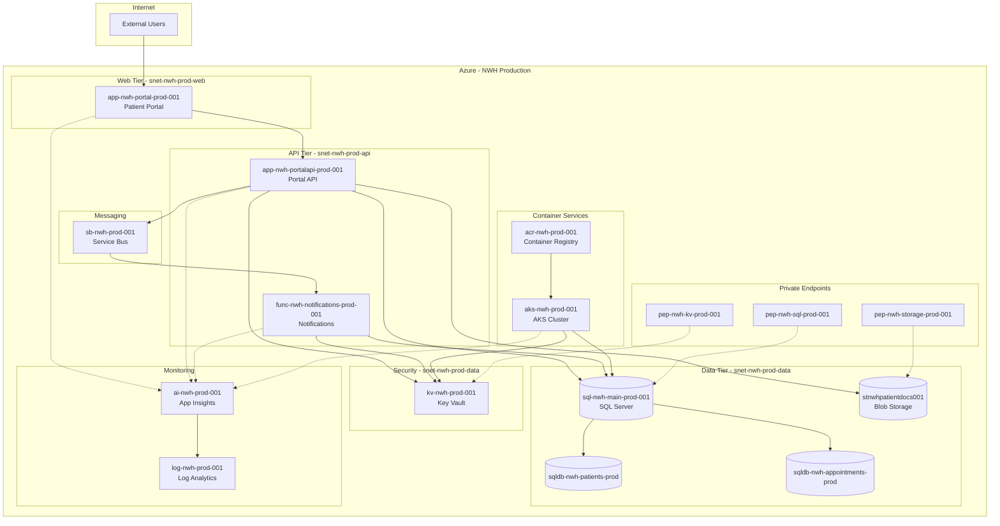

# Azure Architecture Dependency Map

**Client:** Northwind Health  
**Scope:** Production Environment  
**Last Updated:** February 2026

---

## Overview

This diagram illustrates the key dependencies and data flows in the Northwind Health Azure production environment. Understanding these relationships is critical for:

- Impact analysis before making changes
- Troubleshooting production issues
- Planning disaster recovery
- Identifying single points of failure

---

## Architecture Diagram



---

## How to Read This Diagram

### Notation

| Symbol | Meaning |
|--------|---------|
| Solid arrow (`→`) | Direct dependency or data flow |
| Dashed arrow (`⇢`) | Monitoring/telemetry flow or private endpoint connection |
| Rectangle | Compute resource (App Service, Function, AKS) |
| Cylinder | Data store (SQL, Storage) |
| Grouped box | Logical tier or subnet boundary |

### Traffic Flow

1. **User → Portal:** External users access the patient portal via HTTPS
2. **Portal → API:** Frontend calls backend API for data operations
3. **API → Data:** API reads/writes to SQL databases and blob storage
4. **API → Service Bus:** Asynchronous events published to queue
5. **Service Bus → Function:** Notification function triggered by messages
6. **All Services → Key Vault:** Secrets and certificates retrieved at runtime
7. **All Services → App Insights:** Telemetry sent for monitoring

---

## Key Dependencies

### Critical Path (Patient Portal)

```
Users → app-nwh-portal-prod-001 → app-nwh-portalapi-prod-001 → sql-nwh-main-prod-001
```

**Impact if unavailable:** Portal completely inaccessible to patients

### Notification Flow

```
app-nwh-portalapi-prod-001 → sb-nwh-prod-001 → func-nwh-notifications-prod-001
```

**Impact if unavailable:** Email/SMS notifications delayed or lost

### Security Dependencies

All services depend on `kv-nwh-prod-001` for:
- Database connection strings
- Storage account keys
- API keys for external services
- SSL/TLS certificates

**Impact if unavailable:** All services unable to authenticate

---

## Network Topology

### Virtual Network: `vnet-nwh-prod-eastus-001`

| Subnet | CIDR | Purpose |
|--------|------|---------|
| `snet-nwh-prod-web` | 10.1.1.0/24 | Web tier resources |
| `snet-nwh-prod-api` | 10.1.2.0/24 | API tier resources |
| `snet-nwh-prod-data` | 10.1.3.0/24 | Data tier, private endpoints |

### Private Endpoints

| Endpoint | Target | Purpose |
|----------|--------|---------|
| `pep-nwh-sql-prod-001` | SQL Server | Secure database access |
| `pep-nwh-storage-prod-001` | Storage Account | Secure blob access |
| `pep-nwh-kv-prod-001` | Key Vault | Secure secret retrieval |

---

## Single Points of Failure

| Component | Risk | Mitigation |
|-----------|------|------------|
| SQL Server | High | Geo-redundant backup, consider read replica |
| Key Vault | High | Soft-delete enabled, backup policies |
| App Service Plan | Medium | Autoscaling configured, zone redundancy available |
| Service Bus | Medium | Consider geo-DR pairing |

---

## Caveats

1. **Simplified View:** This diagram shows primary dependencies; some secondary connections omitted for clarity
2. **Static Snapshot:** Reflects architecture as of assessment date; may drift over time
3. **External Services:** Third-party integrations (email provider, SMS gateway) not shown
4. **DNS Resolution:** Private DNS zones required for private endpoint resolution (not shown)

---

## Suggested Next Steps

1. **Validate Dependencies:** Walk through diagram with development team to confirm accuracy
2. **Document External Dependencies:** Add third-party service connections
3. **Create Runbooks:** Develop incident response procedures for each critical path
4. **Test Failover:** Conduct tabletop exercise for Key Vault and SQL outage scenarios
5. **Automate Discovery:** Implement Azure Resource Graph queries to detect drift

---

## Related Files

- [`dependency-map.mmd`](dependency-map.mmd) — Raw Mermaid source file
- [`../sample-inventory/resources.csv`](../sample-inventory/resources.csv) — Full resource inventory

---

*This diagram should be updated whenever significant architectural changes are made.*
