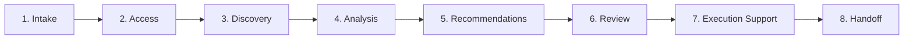

# Azure Audit Standard Operating Procedure

**Document Type:** Standard Operating Procedure  
**Version:** 1.0  
**Last Updated:** February 2026  
**Author:** Azure Governance Consulting

---

## Purpose

This document defines the standard process for conducting an Azure environment audit. Following this procedure ensures consistent, thorough, and safe assessments across all client engagements.

---

## Scope

This SOP covers:
- Initial client intake and scoping
- Access provisioning and security
- Environment discovery and inventory
- Analysis and findings development
- Recommendations and reporting
- Execution support and handoff

---

## Process Overview



---

## Phase 1: Intake

**Duration:** 1-2 meetings  
**Participants:** Client stakeholders, audit lead

### Objectives
- Understand business context and goals
- Define scope boundaries
- Identify key stakeholders and contacts
- Establish timeline and milestones

### Intake Questions

1. **Environment Size**
   - How many subscriptions?
   - Approximate number of resources?
   - Which regions are in use?

2. **Business Drivers**
   - What prompted this audit? (Cost, security, compliance, M&A)
   - What does success look like?
   - Any specific concerns or known issues?

3. **Technical Context**
   - Primary workloads and applications
   - Compliance requirements (HIPAA, SOC2, PCI)
   - Existing documentation or architecture diagrams
   - Change management process in place?

4. **Access & Scheduling**
   - Who approves access requests?
   - Maintenance windows for any changes?
   - Points of contact for technical questions?

### Deliverables
- [ ] Signed engagement letter / SOW
- [ ] Completed intake questionnaire
- [ ] Identified stakeholders and contacts
- [ ] Agreed timeline

---

## Phase 2: Access Provisioning

**Duration:** 1-3 days  
**Participants:** Client IT/Security, audit lead

### Access Requirements

| Access Level | Scope | Purpose |
|--------------|-------|---------|
| **Reader** | All in-scope subscriptions | Resource discovery, cost analysis |
| **Reader** | Microsoft Entra ID | Identity review |
| **Reader** | Azure Cost Management | Cost data export |
| **Log Analytics Reader** | Relevant workspaces | Diagnostic review |

### Read-Only First Policy

**⚠️ CRITICAL:** Discovery phase uses ONLY Reader access. No write permissions until:
1. Discovery is complete
2. Findings are reviewed with client
3. Change plan is approved
4. Proper backups are in place

### Access Request Process

1. Client creates custom role or assigns built-in Reader role
2. Assign to consultant's Microsoft account or guest identity
3. Verify access via Azure Portal
4. Document access grant date and scope

### Security Checklist

- [ ] MFA enabled on consultant account
- [ ] Access limited to in-scope subscriptions only
- [ ] No access to production secrets (Key Vault data plane)
- [ ] Access expiration date set
- [ ] Audit log monitoring enabled

---

## Phase 3: Discovery

**Duration:** 2-5 days depending on environment size  
**Participants:** Audit team

### Discovery Tools

**Azure Resource Graph Queries**

Export all resources in scope:
```kusto
resources
| where subscriptionId in~ ("<subscription-id-1>", "<subscription-id-2>")
| project subscriptionId, resourceGroup, name, type, location, tags, properties
```

> **Note:** Replace `<subscription-id-1>` etc. with actual subscription IDs from the client environment.

List all resource groups:
```kusto
resourcecontainers
| where type == "microsoft.resources/subscriptions/resourcegroups"
| project subscriptionId, name, location, tags
```

Find untagged resources:
```kusto
resources
| where isnull(tags) or tags == "{}"
| project subscriptionId, resourceGroup, name, type
```

Find orphaned disks:
```kusto
resources
| where type =~ "Microsoft.Compute/disks"
| where properties.diskState == "Unattached"
| project name, resourceGroup, properties.diskSizeGB, properties.timeCreated
```

**Azure CLI Commands**

List all subscriptions:
```bash
az account list --output table
```

Export resource list:
```bash
az resource list --subscription "NWH-Production" --output json > resources.json
```

Get cost data:
```bash
az consumption usage list --start-date 2026-01-01 --end-date 2026-01-31 --output json
```

### Discovery Checklist

- [ ] Export complete resource inventory
- [ ] Document resource groups and organization
- [ ] Capture tag usage and gaps
- [ ] Map network topology (VNets, subnets, peering)
- [ ] Identify private endpoints and DNS configuration
- [ ] List all App Service Plans and hosting
- [ ] Document SQL servers and databases
- [ ] Inventory storage accounts and tiers
- [ ] Review Key Vault configuration (no data plane access)
- [ ] Capture App Insights and Log Analytics configuration
- [ ] Identify container services (ACR, AKS)
- [ ] Note any legacy or orphaned resources
- [ ] Export cost data for analysis period

### Documentation During Discovery

Create/update these artifacts:
1. `resources.csv` — Full resource inventory
2. `resources.json` — Same data in JSON format
3. `tags-and-owners.csv` — Tag matrix and ownership
4. Network topology diagram (if not provided)
5. Discovery notes document

---

## Phase 4: Analysis

**Duration:** 3-5 days  
**Participants:** Audit team

### Analysis Areas

| Area | Key Questions |
|------|---------------|
| **Naming & Organization** | Do resources follow a consistent standard? Are resource groups logical? |
| **Tagging** | Are required tags present? Who owns what? |
| **Cost** | What are the top drivers? Obvious waste? Rightsizing opportunities? |
| **Security** | Private endpoints in use? Key Vault for secrets? RBAC appropriate? |
| **Monitoring** | App Insights configured? Logging enabled? Retention appropriate? |
| **Architecture** | Dependencies documented? Single points of failure? |
| **Compliance** | Data classification applied? Encryption at rest/transit? |

### Analysis Outputs

1. **Cost Analysis Summary**
   - Total spend by service, environment, subscription
   - Top cost drivers
   - Waste identification
   - Quick win opportunities

2. **Naming Convention Assessment**
   - Current patterns observed
   - Gap analysis against best practices
   - Recommended standard

3. **Dependency Map**
   - Key resource relationships
   - Critical paths
   - Single points of failure

4. **Risk Register**
   - Identified issues ranked by severity
   - Business impact assessment
   - Remediation recommendations

---

## Phase 5: Recommendations

**Duration:** 2-3 days  
**Participants:** Audit lead

### Recommendation Structure

Each recommendation should include:

1. **Finding:** What was observed
2. **Risk:** Why it matters
3. **Recommendation:** What to do about it
4. **Effort:** Complexity and dependencies
5. **Priority:** Critical / High / Medium / Low

### Recommendation Categories

- **Quick Wins:** Low effort, immediate value
- **Short-Term:** Requires planning, achievable this month
- **Medium-Term:** Requires coordination, this quarter
- **Strategic:** Major initiative, ongoing effort

### Deliverables

- [ ] Cost analysis summary with savings opportunities
- [ ] Quick wins document
- [ ] Naming convention standard (if missing)
- [ ] Dependency diagram
- [ ] Executive presentation deck
- [ ] Detailed findings report

---

## Phase 6: Review

**Duration:** 1-2 meetings  
**Participants:** Client stakeholders, audit team

### Review Meeting Agenda

1. Executive summary (10 min)
2. Key findings walkthrough (20 min)
3. Cost analysis and savings (15 min)
4. Recommended quick wins (15 min)
5. Questions and discussion (30 min)
6. Next steps and priorities (10 min)

### Post-Review Actions

- [ ] Incorporate client feedback
- [ ] Clarify any misunderstandings
- [ ] Prioritize recommendations with client input
- [ ] Define execution plan

---

## Phase 7: Execution Support

**Duration:** Variable based on scope  
**Participants:** Client team, audit team (advisory)

### Execution Principles

1. **Client Ownership:** Client makes all changes; we advise
2. **Staged Approach:** Quarantine → Validate → Delete/Modify
3. **Non-Production First:** Test changes in dev before prod
4. **Document Everything:** Change log for all modifications
5. **Rollback Ready:** Know how to undo every change

### Change Categories

| Type | Approval | Timing |
|------|----------|--------|
| Delete unused resource | Technical lead | Anytime after quarantine period |
| Scale down (non-prod) | Technical lead | Business hours |
| Scale down (production) | Change board | Maintenance window |
| Configuration change | Technical lead | Low-traffic period |
| Network change | Change board + security | Maintenance window |

### Change Control Reference

See [`change-control-and-safety.md`](change-control-and-safety.md) for detailed guardrails.

---

## Phase 8: Handoff

**Duration:** 1 meeting + documentation delivery  
**Participants:** Client stakeholders, audit lead

### Handoff Deliverables

1. **Final Report Package**
   - Executive summary
   - Detailed findings
   - All supporting artifacts

2. **Updated Documentation**
   - Current-state resource inventory
   - Dependency diagrams
   - Naming convention standard

3. **Knowledge Transfer**
   - Resource Graph queries (client can re-run)
   - Monitoring recommendations
   - Ongoing governance suggestions

4. **Recommendations Tracker**
   - Prioritized list with status
   - Owner assignments
   - Target completion dates

### Handoff Meeting Agenda

1. Summary of work completed
2. Review remaining recommendations
3. Knowledge transfer and queries
4. Ongoing support options
5. Feedback collection

---

## Documentation Checklist

### Minimum Deliverables

- [ ] Resource inventory (CSV/JSON)
- [ ] Tag and ownership matrix
- [ ] Naming convention standard or assessment
- [ ] Cost analysis summary
- [ ] Quick wins document
- [ ] Dependency diagram
- [ ] Executive presentation
- [ ] Engagement checklist (completed)

### Optional Deliverables

- [ ] Detailed security assessment
- [ ] Compliance gap analysis
- [ ] Azure Policy recommendations
- [ ] Infrastructure as Code templates
- [ ] Monitoring dashboard templates

---

## Quality Standards

- All findings validated before reporting
- Cost estimates include assumptions and caveats
- Recommendations are actionable and specific
- No real client data in sample documents
- Consistent formatting and terminology

---

## Related Documents

- [`change-control-and-safety.md`](change-control-and-safety.md) — Safety guardrails and rollback procedures
- [`engagement-checklist.md`](engagement-checklist.md) — Reusable engagement checklist

---

*This SOP is a living document. Update as processes evolve and lessons are learned.*
